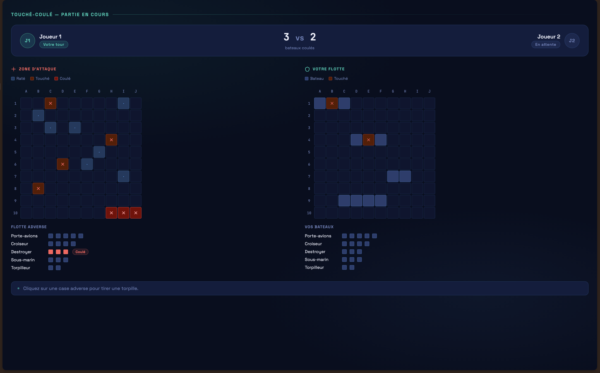

# Découpage de la Vue (Partie En Cours)

## Header.tsx

Dans le Header.tsx on retrouvera le titre ici "Touché-Coulé + état de la partie"...
On pourrait imaginer dans le futur un logo à la place de texte.

- ### ScoreBoard.tsx

    Dans le Header.tsx on retrouvera donc d'autres composant tels que ScoreBoard.tsx qui affichera le score de la partie ( combien de bateaux on été coulés).

- ### PlayerCard.tsx

    Dans le Header.tsx on retrouvera aussi les PlayerCard représentée par le composant PlayerCard.tsx ... Il affichera le pseudo du joueur, si c'est à son tour ou non et aussi sa profile picture (pp).

---

## Body.tsx

Dans le Body.tsx on retrouvera la partie la plus importante de la page les Boards de jeu donc une pour mapper nos attaques et le placements de nos bateaux et leurs états...

---

- ### BoardCard.tsx

    Dans le BoardCard.tsx on retrouvera plusieurs éléments d'informations nottament la légende des deux boards, le code couleurs pour les cases et l'état globale de la flotte...

  - ### Tiles.tsx 

      Tiles.tsx représente une cases de la board et ce composant est nécessaire car les cases représentent un point centrale de la vue car elles ont plusieurs état qui transmettent au joueurs le résultat des attaques infligées/subis.(*Raté,touché,Coulé*)

  - ### Flotte.tsx

      Représentant l'état de la flotte à un instant T. Montrant les bateaux *intacts, touchés et coulés*.

---

## Footer.tsx

On pourra retrouver ici différentes informations pour aider le joueur dans son expérience de jeu...